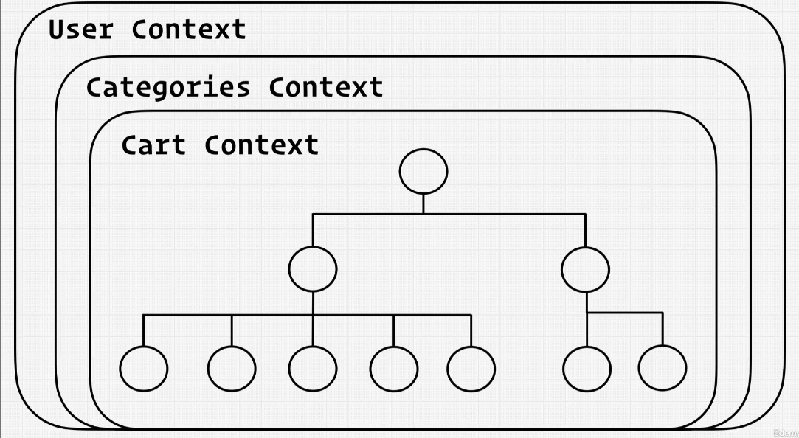
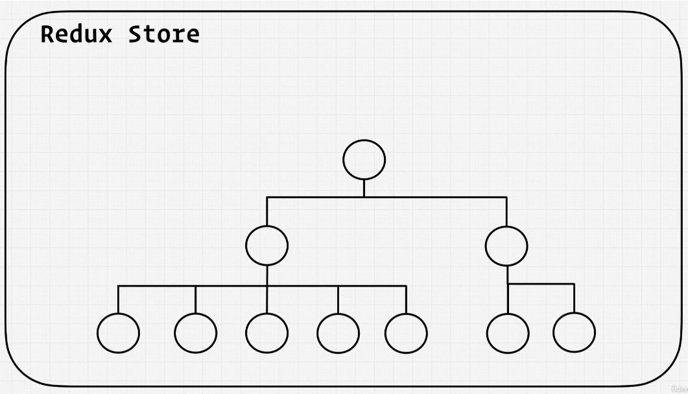
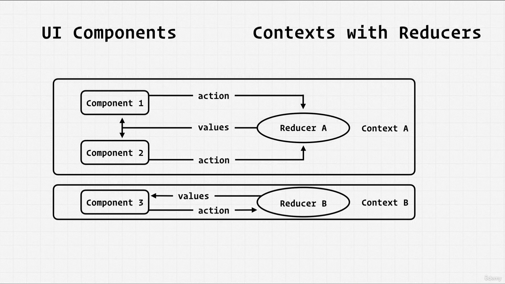
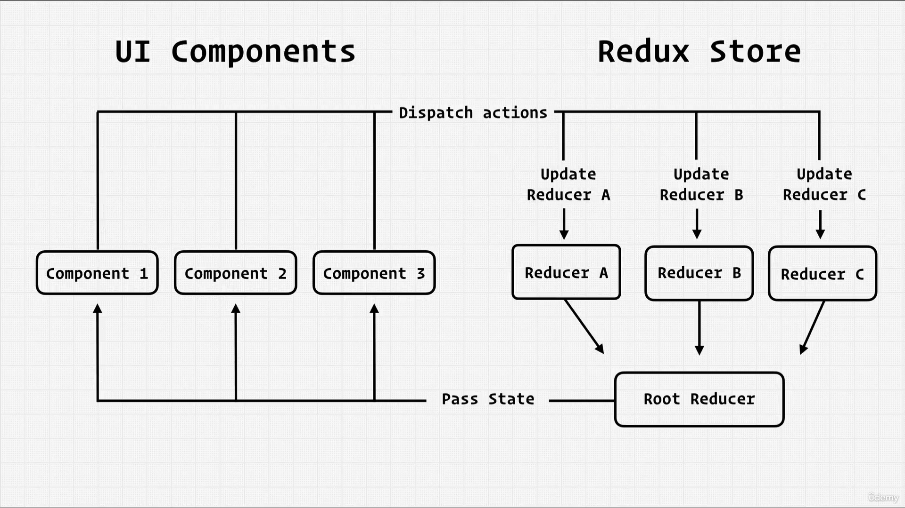

# How to fork and clone

One quick note about cloning this project. If you wish to make commits and push your own code, you'll need to fork the project first. Forking allows you to have your own copy of this repository by adding a duplicate version in your own profile!

You can see the fork button in the top right corner of every GitHub project; click it and a copy of the project will be added to your GitHub profile under the same name as the original project.


After forking the project, simply clone it the way you would from the new forked project in your own GitHub repository and you can commit and push to it freely!

# After you fork and clone:

## Install dependencies

In your terminal after you clone your project down, remember to run either `yarn` or `npm install` to build all the dependencies in the project.

## Set your firebase config

Remember to replace the config variable in your firebase.utils.js with your own config object from the firebase dashboard! Navigate to the project settings gear icon > project settings and scroll down to the config code. Copy the object in the code and replace the variable in your cloned code.


# Branching strategy

After forking this repository and cloning it down, you will have access to all the lesson branches with code at different checkpoints throughout the course. If for some reason you need to work from the codebase at one of these lesson branch checkpoints, follow these steps:

1. Checkout to the lesson-# (let's use lesson-15 as an example) branch

```
git checkout lesson-15
```

2. Branch off from lesson-15. This will create a new branch where the code of lesson-15 is the basis for your new branch. You can name your new branch whatever you want! Let's say we use my-main-branch as the name.

```
git checkout -b my-main-branch
```

3. Now you can just code on this branch, push code from this branch up to your forked repo etc. The main thing to remember is that you want to be on this branch for your own code, so remember what you named this branch!

<!-- REACT ROUTING -->

// BrowserRoute

first importing the BrowserRoute component in the Top most level component in out application

import { BrowserRouter } from 'react-router-dom';

In this case it is our Highest level component is <App />

<App /> component in the index.js file

Now the <App /> component must be nested inside the <BrowserRoute /> component!

with the <BrowserRoute /> placed,

It unlocks or enables us to use the routing features in the browser

<!-- Routing -->

Now Setting up the Routing part itself

For that we need to first import {Routes and Route} components form the 'react-route-dom'

<import { Routes, Route } from "react-router-dom";>

Now Routes and Route can be used as follows

<Routes> ---> Enables us to use the Route component
<Route path='/home' element={<Home />}> ----> the path prop checks if the url is ending with '/home' and renders the element prop.. Here <Home /> component is rendered to page
<Route path='shop' element={<Shop />} />
</Route>
</Routes>

<!-- Using <Link /> -->

# hey there

[] done => abc

Link component will creates a link through which you can route between pages!!

<Link className="nav-link" to='/shop'>Shop</Link> ----> The "to" attribute sets the destination of the route and you can also pass in component into the Link tag

// STARTING WITH ------------- REDUX --------------

# ====> CONTEXT API VS REDUX <======

## 1: Accessibility (of data)
## 2: Flow of data

 => context Api
 => Redux store

=> data flow




# ------------- REDUX ----------------

1: Setting up a <STORE> folder => containing all of redux code

==> This is where our state live, receive actions and dispatch actions
==> Every store for it to work, needs reducers!

## // ROOT-REDUCER => combination of all reducers

==> import { combineReducers } from "redux";

--- combineReducers basically allows you to combine multiple reducers!

# -------- Flow in Redux Store and Reducers ------------

## -------- || THE REDUCERS || -------------

==> The reducers in redux receives every single action that gets dispatches and returns a default as "state" value.

1: Reducer(UserReducer) => performs certain function and returns a state based on dispatch function

## ---------- || THE ROOT-REDUCERS || -------------

2: now the reducer(UserReducer) is combined with remaining reducers in rootReducer.js

==> here -> we have a combineReducers function from 'react-redux';

<export const rootReducer = combineReducers({
user: userReducer
}) >

// values => key:value => nameOfTheReducer: actual reducer function

## ------------ || THE STORE || ---------------

3: inside store.js we start with importing
-> compose, createStore, middleWares

Now to create a store we use <createStore function>

<export const store = createStore(rootReducer, undefined, middleWares)>

-> the first argument is the <rootReducer function>
-> the second argument are any additional default states. here <undefined>
-> the third argument is the <middleWares> to watch or keep track of the state.
-> inOrder for the middleWares to work we need to call <compose>

<const composedEnhancers = compose(applyMiddleware(...middleWares))>

-> 

whenever an action is dispatched with a certain type and payload

the reducer then checks for the type of action and updates the state with or without the payload, depending on the action type.

## curry functions 😭

=> A curry function is a function inside another function basically chained


const currFun = (a) => (b, c) => {
    return a + b - c; 
}

const with5 = currFun(5)
const with10 = currFun(10)

with5(6, 1)
with10(6, 1)

# THUNK 
- will be updated later 

# Sagas (AsyncRedux)

- terms and actions exchange =` yield <-> async` `put <-> dispatch` 